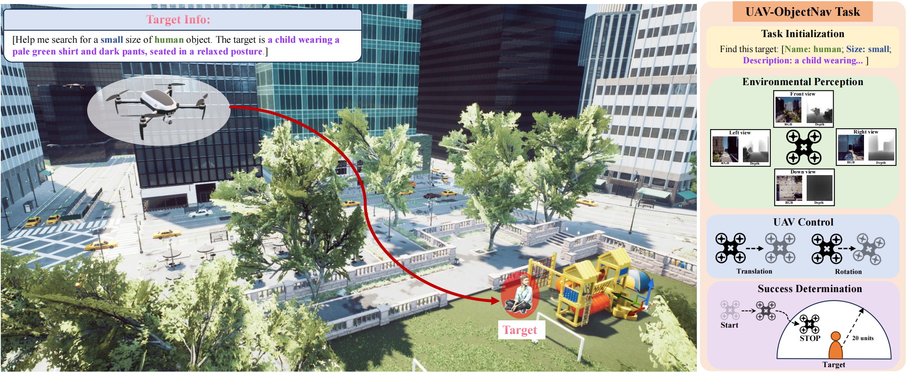

# UAV-ON: A Benchmark for Open-World Object Goal Navigation with Aerial Agents

----------

## Content

- [Introduction](#introduction)
- [Getting Started](#getting-started)
- [Usage](#usage)
- [TODO](#todo)
- [Acknowledgment](#acknowledgment)

## Introduction

<p align="center">
  
</p>

Aerial navigation is a fundamental yet underexplored capability in embodied intelligence, enabling agents to operate in large-scale, unstructured environments where traditional navigation paradigms fall short. However, most existing research follows the Vision-and-Language Navigation (VLN) paradigm, which heavily depends on step-by-step linguistic instructions, limiting its scalability and autonomy. To bridge this gap, we propose UAV-ON, a benchmark designed to facilitate research on large-scale Object Goal Navigation (ObjectNav) by aerial agents operating in open-world environments. UAV-ON comprises 14 high-fidelity Unreal Engine environments with diverse semantic regions and complex spatial layouts, covering urban, natural, and mixed-use settings. It defines 1270 annotated target objects, each paired with a structured semantic prompt that encodes category, estimated physical footprint, and detailed visual descriptors, allowing grounded reasoning. These prompts serve as semantic goals, introducing realistic ambiguity and complex reasoning challenges for aerial agents. We also propose Aerial ObjectNav Agent (AOA), a modular baseline policy that integrates prompt semantics with egocentric observations to perform long-horizon, goal-directed exploration. Empirical results demonstrate that standard baselines perform poorly in this setting, underscoring the compounded difficulty of aerial navigation and semantic goal grounding. UAV-ON aims to advance research on scalable UAV autonomy driven by semantic goal descriptions in complex real-world environments.

## Getting Started

- **Step1: Install all dependencies**

    ```bash
    conda create -n uavon python==3.8
    conda activate uavon
    pip install -r requirements.txt
    ```

- **Step2: Prepare the simulation environment**

    You can get UAV-ON train environments from [train envs](https://huggingface.co/datasets/Kyaren/UAV-ON-envs-train) (44.1G) and [test envs](https://huggingface.co/datasets/Kyaren/UAV-ON-envs-test) (26.8G)
    The environment directory should be structured as follows:

    ``` text
    TRAIN_ENVS/
    ├── Barnyard/
    ├── BrushifyRoad/
    ├── CabinLake/
    └── ... (other training environments)

    TEST_ENVS/
    ├── Barnyard/
    ├── BrushifyRoad/
    ├── CabinLake/
    └── ... (other testing environments)
    ```

- **Step3: Get dataset json files**
    You can download dataset from [here](https://huggingface.co/datasets/Kyaren/UAV-ON-dataset)，you can use [script](https://github.com/Kyaren/UAV_ON/tree/main/scripts) to merge split data files into a single JSON file

- **Project directory structure**
  
  ```text
  workspace/
  ├── UAV_ON/        
  ├── DATASET/        
  ├── TRAIN_ENVS/
  └── TEST_ENVS/
  ```

## Usage
  
  1.First, you should launch the AirSim environment server.

  ```bash
  python airsim_plugin/AirVLNSimulatorServerTool.py --port=30000 --root_path= "your workspace path"
  ```

  2.Then, you can execute the bash script to run the simulator

  ```bash
  #AOA-F/V
  bash scripts/eval_fixed.sh
  bash scripts/eval_unfixed.sh
  #CLIP-H
  bash scripts/eval_cliph.sh

  bash scripts/metric.sh
  ```

  If you encounter a "**Ping returned false**" error and **no output in server console**, you can run the following command:

  ```bash 
  pip uninstall msgpack msgpack-python msgpack-rpc-python
  pip install msgpack-rpc-python
  ```


### TODO

- Example of Reinforcement Learning using PPO
- Example of training a model using Imitation Learning

### **Acknowledgment**

- The simulation interaction module of this project is built upon the works of [AirVLN](https://github.com/AirVLN/AirVLN/) and [TravelUAV](https://github.com/prince687028/TravelUAV/). We sincerely thank them for their outstanding contributions.
